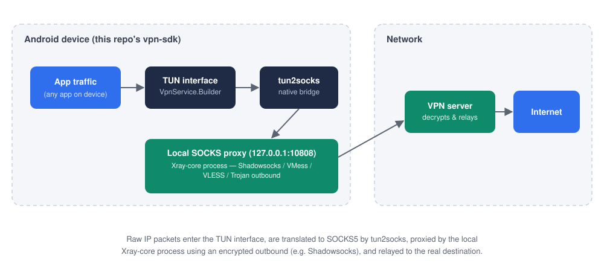
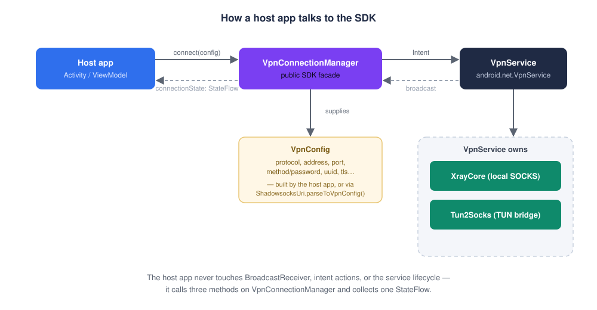
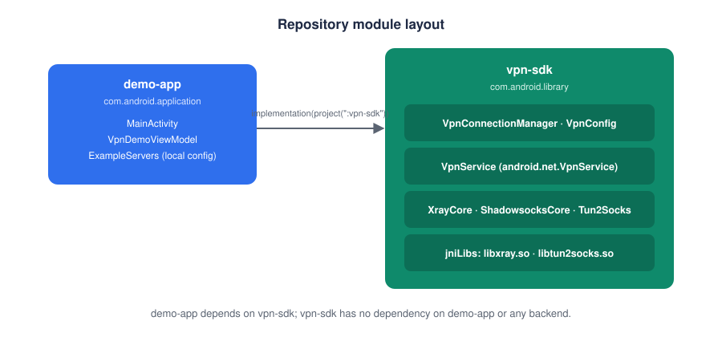

# Building a Shadowsocks/Xray VPN SDK for Android: A Client-Side Deep Dive

*A technical walkthrough of how mobile VPN clients establish tunnels — with diagrams,
code, and a reusable open-source SDK + demo app you can read, run, and build on.*

> **Repository**: [shadowsocks-xray-vpn-sdk-android](https://github.com/Faisal2736/shadowsocks-xray-vpn-sdk-android)
> **Diagrams**: the images in this article live at
> [`docs/images/`](https://github.com/Faisal2736/shadowsocks-xray-vpn-sdk-android/tree/main/docs/images)
> in the repo as editable SVGs, if you want to reuse or adapt them.

### Contents

1. [Why this article](#why-this-article)
2. [What a VPN actually does, technically](#what-a-vpn-actually-does-technically)
3. [Client/server tunnel architecture](#clientserver-tunnel-architecture)
4. [What Shadowsocks is](#what-shadowsocks-is)
5. [What Xray adds](#what-xray-adds)
6. [How the client connects to the backend, step by step](#how-the-client-connects-to-the-backend-step-by-step)
7. [How the SDK abstracts this](#how-the-sdk-abstracts-this)
8. [Repository structure](#repository-structure)
9. [How the demo app proves it](#how-the-demo-app-proves-it)
10. [Using this repository](#using-this-repository)
11. [Closing note](#closing-note)

---

## Why this article

VPN apps look simple from the outside: tap Connect, get a green checkmark. Underneath,
a mobile VPN client is coordinating a system-level network interface, a proxy protocol
handshake, and a packet-forwarding bridge — all while surviving network changes,
backgrounding, and process death.

I've spent years building and scaling a VPN application to 5M+ users. This article,
paired with an open-source [demo repository](https://github.com/Faisal2736/shadowsocks-xray-vpn-sdk-android),
is my attempt to make that engineering visible: not the production system itself, but a
clean, from-scratch reference implementation of the same core mechanics — built
specifically to be read, diagrammed, and reused.

## What a VPN actually does, technically

A VPN client doesn't "encrypt your internet" in the abstract — concretely, it:

1. **Creates a virtual network interface (TUN)** on the device. The OS routes some or
   all IP traffic into this interface instead of the physical network.
2. **Reads raw IP packets** off that interface.
3. **Forwards them to a remote server** over some transport — encrypted, and usually
   disguised as something else (this is where proxy protocols like Shadowsocks and Xray
   come in).
4. **The remote server decrypts, unwraps, and re-sends** the packets to their real
   destination on the internet, then relays responses back through the same tunnel.

On Android, step 1 is `android.net.VpnService` — an OS API that hands your app a file
descriptor representing the TUN device. Everything after that (steps 2–4) is on you, the
app developer, to implement or wire up.

## Client/server tunnel architecture



Two architectural choices matter here:

- **Where does IP-packet parsing happen?** Writing a full userspace TCP/IP stack is a
  large undertaking. Most production Android VPN clients (including this project)
  offload that to **tun2socks**: a well-tested native component that reads raw packets
  from the TUN fd and turns them into ordinary SOCKS5 connections.
- **What terminates the SOCKS5 connection?** A local proxy process. This project uses
  **Xray-core** running as a subprocess, configured via a generated `config.json`,
  listening on `127.0.0.1` as a SOCKS5 inbound and forwarding to the real VPN server as
  whichever outbound protocol was configured (Shadowsocks, VMess, VLESS, Trojan).

This split — a TUN↔SOCKS bridge plus a protocol-aware local proxy — is what lets one
Android `VpnService` implementation support multiple backend protocols without
rewriting the packet-handling layer for each one.

## What Shadowsocks is

Shadowsocks is a lightweight proxy protocol designed to look like ordinary encrypted
traffic rather than an obvious VPN handshake. At its core it's simple:

- The client and server share a **method** (an AEAD cipher — e.g. `aes-256-gcm` or
  `chacha20-ietf-poly1305`) and a **password**, from which a key is derived.
- Each connection sends a **SOCKS5-style destination address** (IPv4, IPv6, or domain
  name) followed by the payload, all encrypted with that AEAD cipher.
- There's no separate control-plane handshake — no TLS negotiation, no visible protocol
  fingerprint beyond "some encrypted bytes." That's the point: it's built to be hard to
  distinguish from generic traffic.

This repository includes a from-scratch reference implementation of the AEAD framing
and address encoding (`ShadowsocksEncryption`, `ShadowsocksProtocol`) — useful for
understanding the wire format, even though the SDK's default runtime path delegates the
actual protocol work to Xray-core's implementation for production-grade correctness and
performance.

## What Xray adds

Xray-core is a proxy platform that speaks several protocols through one config-driven
engine: **VMess** and **VLESS** (its own protocols, VLESS being the lighter,
TLS-oriented successor to VMess), **Trojan** (mimics HTTPS traffic), and
**Shadowsocks** itself as one of its supported outbounds — plus transport options like
WebSocket and TLS on top of any of them.

Practically, this means one `config.json` shape can describe wildly different backend
setups:

```json
{
  "inbounds": [{ "listen": "127.0.0.1", "port": 10808, "protocol": "socks" }],
  "outbounds": [{
    "protocol": "vless",
    "settings": { "vnext": [{ "address": "server.example.com", "port": 443,
      "users": [{ "id": "uuid-here", "encryption": "none" }] }] },
    "streamSettings": { "network": "ws", "security": "tls" }
  }]
}
```

`XrayCore.kt` in this repo builds exactly this kind of config dynamically from a single
`VpnConfig` object, switching on `protocol` to assemble the right outbound —
Shadowsocks, VMess, VLESS, or Trojan — with optional WebSocket/TLS stream settings.

## How the client connects to the backend, step by step

1. **Permission**: `VpnService.prepare(activity)` returns an `Intent` if the user
   hasn't already granted this app VPN permission; launch it and wait for the result.
2. **Config generation**: turn server details into an Xray `config.json` — a local
   SOCKS5 inbound plus one outbound for the target protocol.
3. **Start Xray**: run the bundled `xray` binary as a subprocess with that config, and
   poll until its local SOCKS port is accepting connections.
4. **Establish the TUN interface**: use `VpnService.Builder` to set the virtual
   address/route/DNS/MTU, and call `.establish()` to get a `ParcelFileDescriptor`.
5. **Bridge TUN to SOCKS**: start `tun2socks` pointed at the TUN fd and the local SOCKS
   port, so it starts translating raw IP packets into SOCKS5 connections. On Android,
   handing a raw file descriptor to a native subprocess goes through a Unix domain
   socket: the app opens a `LocalSocket`, connects to a path the subprocess is
   listening on, and sends the fd using `setFileDescriptorsForSend`.
6. **Health monitoring**: the interface, the Xray process, and tun2socks are all things
   that can die independently — a supervising coroutine polls all three and tears the
   tunnel down cleanly if any of them go unhealthy, rather than leaving the user in a
   silently broken half-connected state.

## How the SDK abstracts this

None of the above should be a consuming app's problem. `vpn-sdk` collapses it into
three calls:

```kotlin
val vpn = VpnConnectionManager(context)
vpn.prepare(activity)?.let { launcher.launch(it); return }
vpn.connect(config)              // VpnConfig — protocol, address, port, method/password, etc.
vpn.connectionState.collect { }  // Idle / Connecting / Connected(bytes, since) / Error / Disconnected
```



Internally, `VpnConnectionManager` starts/stops a `VpnService` via intents and
translates its internal connection-state broadcast into a `StateFlow`, so the host app
never touches `BroadcastReceiver`, intent actions, or the service lifecycle directly.
`VpnConfig` is intentionally the *only* data the SDK needs — no user accounts, no
server-list API, no opinion on where a config came from. That's what makes it
embeddable: build a `VpnConfig` from your own backend, from a pasted `ss://` link
(`ShadowsocksUri.parseToVpnConfig`), or — as the demo does — from a hardcoded local
example.

## Repository structure



```
shadowsocks-xray-vpn-sdk-android/
├── vpn-sdk/     — the reusable library (com.android.library)
└── demo-app/    — a single-screen app that consumes vpn-sdk (com.android.application)
```

`vpn-sdk` has zero knowledge of `demo-app` and zero knowledge of any backend — it is a
plain Gradle library module another app depends on with
`implementation(project(":vpn-sdk"))`, or that could be published to a Maven repo the
same way.

## How the demo app proves it

The demo is one screen: a pre-filled example server form, a Connect/Disconnect button,
a status label, and byte counters. It has no login, no server list, no backend call of
any kind — the example config lives in a plain Kotlin object (`ExampleServers.kt`) with
an obviously-placeholder host (`example.com`). Run it as-is and you'll see the SDK's
error path (a placeholder host won't complete a real handshake); point the form at a
real Shadowsocks/Xray server you control and you'll see Connect → Connected, with live
traffic counters, then Disconnect. That full loop — with nothing hidden behind a
backend — is deliberately the whole point: read the ~150 lines of `MainActivity.kt` and
you've seen the entire integration surface.

## Using this repository

```bash
git clone https://github.com/Faisal2736/shadowsocks-xray-vpn-sdk-android.git
cd shadowsocks-xray-vpn-sdk-android
./gradlew :demo-app:installDebug
```

Grant the VPN permission prompt on-device, tap Connect. See the
[README](https://github.com/Faisal2736/shadowsocks-xray-vpn-sdk-android#readme) for the
full SDK API surface, and
[`THIRD_PARTY_NOTICES.md`](https://github.com/Faisal2736/shadowsocks-xray-vpn-sdk-android/blob/main/THIRD_PARTY_NOTICES.md)
for the verified upstream licenses (MPL-2.0 for the bundled Xray-core binary,
BSD-3-Clause for the bundled tun2socks binary) of the native binaries before
redistributing anything built on top of this.

## Closing note

This project is a public engineering demonstration, built independently of and
separate from the production VPN application I've worked on that serves 5M+ users — no
production code, infrastructure, or credentials are part of this repository. It exists
to make the mechanics of client-side VPN engineering — TUN interfaces, proxy protocols,
native process bridging, and SDK-shaped abstraction — legible to anyone evaluating that
experience.

If you build something with this SDK, or find a rough edge in it, open an issue or a PR
on the [repository](https://github.com/Faisal2736/shadowsocks-xray-vpn-sdk-android) —
it's meant to be read and extended, not just looked at.
